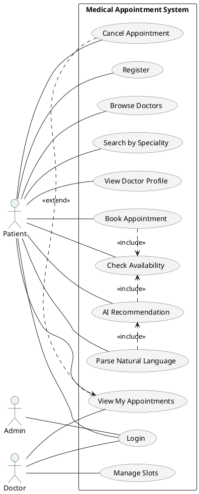
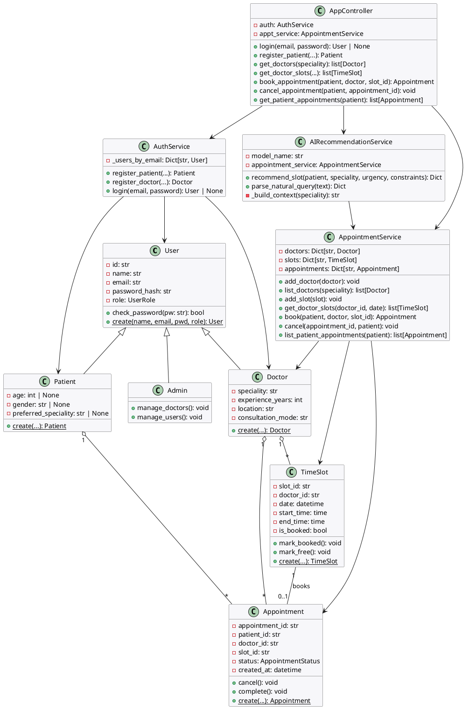
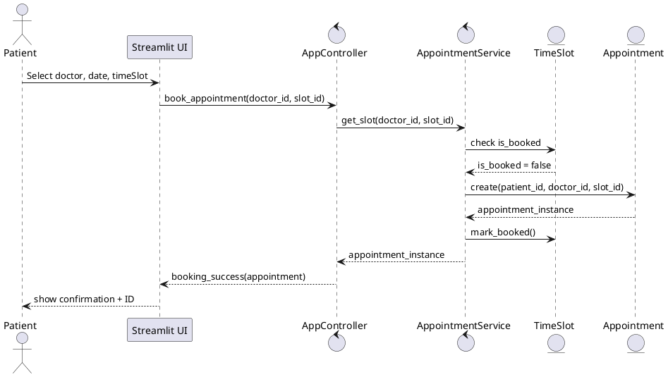
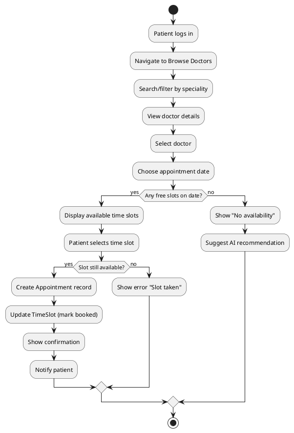
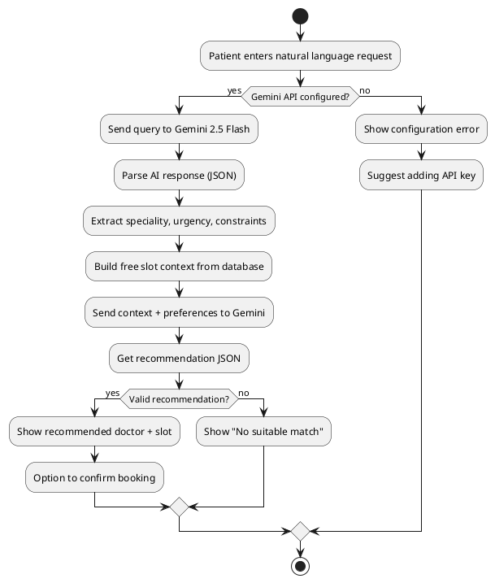

# UML Diagrams - Medical Appointment Scheduling System

## 1. USE CASE DIAGRAM



---

## 2. CLASS DIAGRAM



---

## 3. SEQUENCE DIAGRAM (Book Appointment)



---

## 4. ACTIVITY DIAGRAM (Appointment Booking Workflow)



---

## 5. AI FLOW DIAGRAM



---

## 6. COMPONENT DIAGRAM

```plantuml
@startuml
package "Presentation" {
  component "Streamlit App" as App
  component "Glass Card UI" as UI
}

package "Controllers" {
  component "AppController" as AC
}

package "Services" {
  component "AuthService" as Auth
  component "AppointmentService" as Appt
  component "AIRecommendationService" as AI
}

package "Models" {
  component "Domain Objects" as Models
}

package "External" {
  component "Gemini API" as Gemini
}

App --> AC
UI --> App
AC --> Auth
AC --> Appt
AC --> AI
Appt --> Models
Auth --> Models
AI --> Gemini
AI --> Appt

@enduml
```

---

## How to View Diagrams

1. Copy PlantUML code above
2. Visit https://www.plantuml.com/plantuml/uml/
3. Paste code in editor
4. View rendered diagram
5. Export as PNG/SVG

**Alternative:** Use VSCode extension "PlantUML" for live preview
